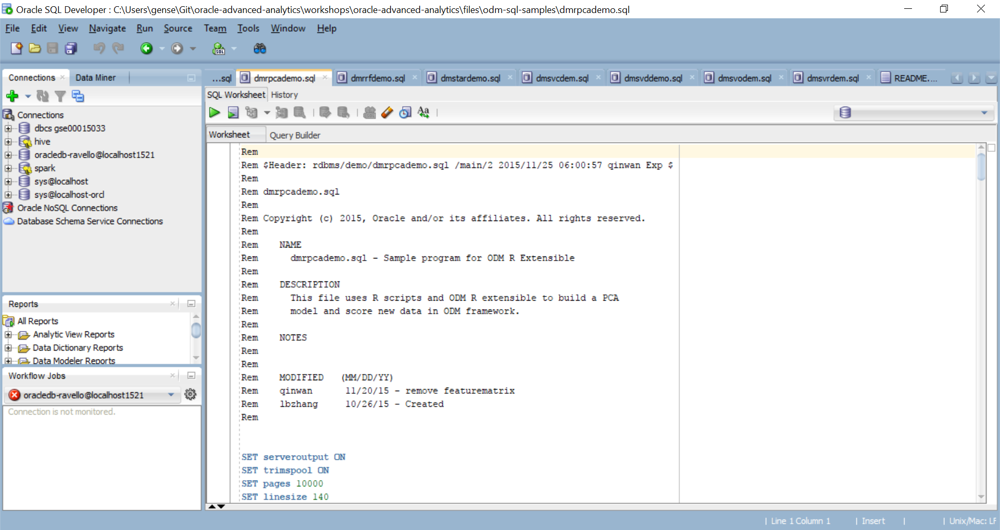
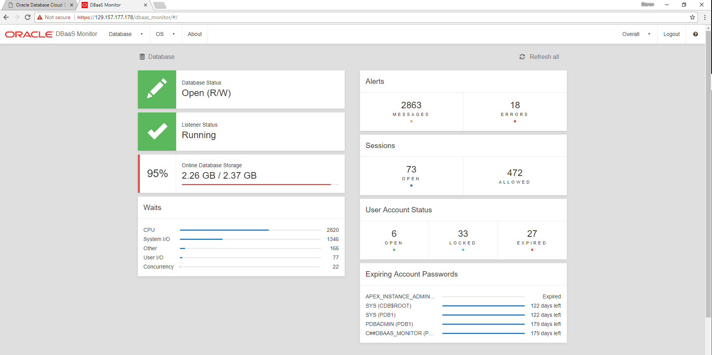

  
Updated: April 4, 2018

 

## Introduction
Installing Oracle Data Miner and Oracle R Enterprise

### Contents in Brief
* Set up an Oracle Database (without spending a dime)
* Get SQL Developer & Oracle Data Miner (also free)
* Connect your Database with SQL Developer (a guide in pictures)
* Installing Oracle R Enterprise

# Oracle Database 💗 - Installation
[Oracle Database](https://en.wikipedia.org/wiki/Oracle_Database) has a lot of fans, and for a good reason. There's more to know about it than any one person can learn so don't be shy and head over to [the documentation](https://docs.oracle.com/en/database/)

You can follow one (or more) of the below sets of instructions to get access to a working instance of Oracle Database. For our purposes Oracle Live SQL won't suffice but I've included it because it's such a cool find! For easy set up provisioning an instance of Database Cloud Service is recommended. 

 

## Learn and Share SQL in your browser
[Oracle Live SQL](https://livesql.oracle.com/apex/livesql/file/index.html) lets us start coding instantly! Just head to this URL and click "Start Coding Now". 

The drawback to Live SQL is we won't be able to connect SQL Developer and Oracle Data Miner, and so won't be able to use the Oracle Data Miner graphical 

 

## Download the Database Locally

### **STEP 1**: Download Oracle Database to run on your machine
Visit the [Oracle Database Software Downloads](http://www.oracle.com/technetwork/database/enterprise-edition/downloads/index.html) and download "Oracle Database 12c Release 1" for your system. 

TODO: how to set up DB locally

 

## Oracle Database Docker image

### **STEP 1**: Download the Dockerfiles and instll scripts
Oracle maintains a [Oracle Docker Images](https://github.com/oracle/docker-images) repository on GitHub. You'll need to be able to run `bash` scripts on your system in order to construct the images, but the directions are there. 

TODO: how to set-up docker + docker container

 

## Oracle Database Cloud Service 

### **STEP 1**: Oracle Cloud Account
TODO: directions to set up account and provision

 

# Oracle Data Miner: Installation & Quick-Start
I wrote this with the help of several articles and can personally vouch that they are excelent resources for further learning!  
* Oracle's Machine Learning & Adv. Analytics Blog - *[Evaluating Oracle Data Mining Has Never Been Easier - Evaluation "Kit" Available - Updated for Oracle Database 12.2c & SQLDEV 17.2](https://blogs.oracle.com/datamining/evaluating-oracle-data-mining-has-never-been-easier-evaluation-kit-available-%E2%80%A2-updated-for-oracle-database-122c-sqldev-42)*
* *[Setting Up Oracle Data Miner 17.2](http://www.oracle.com/webfolder/technetwork/tutorials/obe/db/12c/r1/dm/dm_41/ODM12c-17-2_SetUp.html#overview)* from Oracle Learning Library

## Install

 

### **STEP 1**: Do you have SQL Developer?
Hopefully you already know the answer to this. Oracle Data Miner is an extention to SQL Developer, so if you don't have SQL Developer now is a good time to install it! 
- Head to [SQL Developer's home page](http://www.oracle.com/technetwork/developer-tools/sql-developer/overview/index.html) and follow the instructions for your platform. 
- Make sure you have a recent version (18.1 is the latest as of 2018-01-04)
- SQL Developer requires the [Java Developer Kit (JDK) version 8](http://www.oracle.com/technetwork/java/javase/downloads/jdk8-downloads-2133151.html) or later

 

### **STEP 2**: Set Up Oracle Data Miner
TODO: should I document my run through [the official tutorial](http://www.oracle.com/webfolder/technetwork/tutorials/obe/db/12c/r1/dm/dm_41/ODM12c-17-2_SetUp.html#overview) OR point them to that page OR host the PDF from this directory (to assure no broken links)

 

# Connecting SQL Developer to Oracle Database

## Connection Properties with DBaaS Montior

TODO: again, the [official tutorial](http://www.oracle.com/webfolder/technetwork/tutorials/obe/db/12c/r1/dm/dm_41/ODM12c-17-2_SetUp.html#overview) does a good job of this and so begs the question of whether or not it needs rewriting 

Getting All of the connection details is easy with [DBaaS Monitor](), a service for monitoring the database and virtual machine in [Oracle Database Cloud Service](). 

 

## Connection Properties with SQL PLUS 
TODO: how do you do this?!??! I should've written this when I started here

### **STEP 1**: Connection Name 

- Instructions for Step 1

### **STEP 2**: Username 

- Instructions for Step 2

### **STEP 3**: Password

- Instructions for Step 2

### **STEP 4**: Hostname 

### **STEP 5**: Port 

### **STEP 6**: SID or Service name 

## Connection Properties with SQL PLUS 
TODO: how do you do this?!??! I should've written this when I started here

 

# Oracle R Enterprise
Get Database tables in R!
